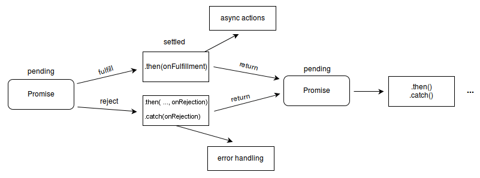

# 콜백 함수?

콜백 함수란 다른 함수의 인자로 함수를 넘겨주고, 해당 함수 내에서 전달 받은 함수를 실행하는 것이다.

주로 매개변수에 함수를 전달해 일회용으로 사용하기 때문에 함수의 이름을 명시하지 않는 익명 함수로 사용한다.

```js
let button = document.getElementById("button"); // 버튼 요소를 선택

// 버튼에 클릭 이벤트 리스너를 추가
button.addEventListener("click", function () {
  // 콜백 함수
  console.log("Button clicked!");
});

// ------------------------------------

setTimeout(() => {
  console.log("Delayed for 1 second.");
}, 1000);

// ------------------------------------
function callback() {
  console.log("hi");
}

function print(callback) {
  callback();
}
```

## 콜백 함수 주의점

### 1. this를 사용한 콜백함수

콜백 함수 내에서 `this`를 사용하면 예상한대로 동작하지 않을 수 있다.

```js
let userData = {
  signUp: "2021-4-06 12:00:00",
  name: "Not Set",
  setName: function (firstName, lastName) {
    this.name = firstName + " " + lastName;
  },
};

function getUserName(firstName, lastName, callback) {
  callback(firstName, lastName);
}

getUserName("홍", "길동", userData.setName);

console.log("1: ", userData.name); // Not Set
console.log("2: ", window.name); // 홍 길동
```

callback 함수의 this는 호출한 함수의 this를 따르게 된다.

따라서 usetData.setName을 호출한 getUserName의 this를 따르게 되고 해당 함수는 전역에서 호출했기 때문에 this는 window를 가리키게 된다.

<details> 
  <summary>예</summary>

```js
// 해당 콜백함수는 userData.setName과 아무런 관계가 없는 함수 형태만 비슷한 독립적인 함수이다.
getUserName("홍", "길동", function (firstName, lastName) {
  this.name = firstName + " " + lastName;
});
```

</details>

```js
let userData = {
  signUp: "2021-4-06 12:00:00",
  name: "Not Set",
  setName: function (firstName, lastName) {
    this.name = firstName + " " + lastName;
  },
};

userData.setName("홍", "길동");

console.log(userData.name); // 홍 길동
```

이 경우에는 setName 메소드를 userData라는 객체에서 호출했기 때문에 this는 userData를 가리키게 된다.

### 2. 콜백 지옥(Callback Hell)

비동기 호출이 자주 일어날 때 콜백 지옥이 발생한다.

콜백 함수 호출이 중첩되어 복잡도가 높아지는 현상이다.


```jsx
function add(x, callback) {
  let sum = x + x;
  console.log(sum);
  callback(sum);
}

add(2, function (result) {
  add(result, function (result) {
    add(result, function (result) {
      console.log("finish!!");
    });
  });
});

// <output>
// 4
// 8
// 16
// finish!!
```

## this 해결 방법

콜백 함수의 this를 보호할 수 있도록 만들어줘야 한다.

### 1. call(), apply() 메서드 사용

- call()

  ```jsx
  // call 메서드 사용
  let userData = {
    signUp: "2021-4-06 12:00:00",
    name: "Not Set",
    setName: function (firstName, lastName) {
      this.name = firstName + " " + lastName;
    },
  };

  function getUserName(firstName, lastName, callback, data) {
    // userData를 받는 매개변수 data를 추가
    callback.call(data, firstName, lastName); // data를 this로 사용
  }

  getUserName("홍", "길동", userData.setName, userData); // userData를 인수로 전달

  console.log("1: ", userData.name); // 홍 길동
  console.log("2: ", window.name); // Not Set
  ```

- apply()

  ```jsx
  // apply 메서드 사용
  let userData = {
    signUp: "2021-4-06 12:00:00",
    name: "Not Set",
    setName: function (firstName, lastName) {
      this.name = firstName + " " + lastName;
    },
  };

  function getUserName(firstName, lastName, callback, data) {
    // userData를 받는 매개변수 data를 추가
    callback.apply(data, [firstName, lastName]); // data를 this로 사용하고 배열을 전달
  }

  getUserName("홍", "길동", userData.setName, userData); // userData를 인수로 전달

  console.log("1: ", userData.name); // 홍 길동
  console.log("2: ", window.name); // Not Set
  ```

화살표 함수도 해결방안이 될 수 있지만 현재 예시에서는 객체 메소드로 화살표 함수가 사용되기 때문에 똑같이 전역을 가리킨다.

### 2. Promise 사용

```jsx
function add(x) {
  return new Promise((resolve, reject) => {
    let sum = x + x;
    console.log(sum);
    resolve(sum);
  });
}

add(2).then((result) => {
  add(result).then((result) => {
    add(result).then((result) => {
      console.log("finish!!");
    });
  });
});

// <output>
// 4
// 8
// 16
// finish!!
```

하지만 promise도 결국 콜백지옥처럼 들여쓰기로 인해 이해하기 쉽지 않다. ⇒ Promise Hell

return을 사용하면 Promise Hell을 탈출 할 수 있다.

```jsx
function add(x) {
  return new Promise((resolve, reject) => {
    let sum = x + x;
    console.log(sum);
    resolve(sum);
  });
}

add(2)
  .then((result) => {
    return add(result);
  })
  .then((result) => {
    return add(result);
  })
  .then((result) => {
    console.log("finish!!");
  });

// <output>
// 4
// 8
// 16
// finish!!
```

# Promise란?

프로미스는 자바스크립트 비동기 처리에 사용되는 객체이다.

## Promise States


### 1. Pending (대기)

비동기 처리 로직이 아직 완료되지 않은 상태를 의미한다.

```jsx
new Promise();
```

### 2. Fulfilled (완료)

비동기 처리가 완료되어 프로미스가 결과 값을 반환해준 상태를 의미한다.

```jsx
new Promise(function (resolve, reject) {
  resolve();
});
```

그리고 이행 상태가 되면 `then()`을 사용하여 처리 결과 값을 받을 수 있다.

```jsx
function getData() {
  return new Promise(function (resolve, reject) {
    var data = 100;
    resolve(data);
  });
}

// resolve()의 결과 값 data를 resolvedData로 받음
getData().then(function (resolvedData) {
  console.log(resolvedData); // 100
});
```

### 3. Rejected (실패)

비동기 처리가 실패하거나 오류가 발생한 상태를 의미한다.

```jsx
new Promise(function (resolve, reject) {
  reject();
});
```

실패 상태가 되면 실패의 처리 결과 값을 `catch()`로 받을 수 있다.

```jsx
function getData() {
  return new Promise(function (resolve, reject) {
    reject(new Error("Request is failed"));
  });
}

// reject()의 결과 값 Error를 err에 받음
getData()
  .then()
  .catch(function (err) {
    console.log(err); // Error: Request is failed
  });
```

## Promise flow



## Promise Chaining

여러 개의 프로미스를 `then, catch, finally`로 연결하여 사용할 수 있다.

### then

프로미스 객체를 반환 받고 해당 결과를 받거나 에러를 받을 수 있다.

```jsx
promise.then(
  function (result) {
    /* 결과(result)를 다룹니다 */
  },
  function (error) {
    /* 에러(error)를 다룹니다 */
  }
);
```

- then의 첫 번째 인수는 프로미스가 resolve 되었을 때 실행되는 함수로 실행 결과 값을 받아 처리
- then의 두 번째 인수는 프로미스가 reject 되었을 때 실행되는 함수로 에러 값을 받아 처리

하지만 주로 성공적(resolve)으로 처리 된 경우만 다루기 때문에 인수를 하나만 전달한다.

### catch

에러가 발생한 경우, 즉 reject된 경우만 다루는 함수로 에러 처리할 때 사용한다.

`.then(undefined, errorHandling)` then에서 첫 번째 인자를 null로 전달하면 동일하게 작동한다.

```jsx
promise.catch(function (error) {
  /* 에러(error)를 다룹니다 */
});
```

then으로 두 개의 인자를 받아서 처리하는 것보다 각각 하나의 역할로 처리하는 것이 코드 가독성에도 좋다.

### finally

try - catch문에 finally 절이 있는 것과 같이, 프로미스에도 존재하며 resolve, reject 상관 없이 무조건 한번만 실행된다.

주로 then, catch에 상관 없이 동일한 처리를 할 경우 사용된다.

```jsx
new Promise((resolve, reject) => {
  setTimeout(() => resolve("결과"), 2000)
})
  .finally(() => alert("프라미스가 준비되었습니다."))
  .then(result => alert(result));
	.catch(err => alert(err));
```

# Async/Await

ES8(ECMAScript 2017)에서 간단하고 가독성 좋게 비동기 처리를 동기 처리처럼 동작하도록 구현하기 위해 도입되었다.

async/await은 프로미스를 기반으로 동작하며, 프로미스의 후속 메서드인 then/catch/finally를 사용하지 않고 동기 처리처럼 사용할 수 있다.

## async 함수

await 키워드는 반드시 async 함수 내부에서 사용해야 한다. async 함수는 async 키워드를 사용해서 정의하며 resolve하는 프로미스 객체를 반환한다.

## await 키워드

프로미스가 settled 상태가 될 때까지 대기하다가 settled 상태가 되면 프로미스가 resolve한 처리 결과를 반환한다. await 키워드는 반드시 프로미스 앞에서 사용해야 한다!

```jsx
const fetch = require("node-fetch");

const getGithubUserName = async (id) => {
  const res = await fetch(`https://api.github.com/users/${id}`);
  const { name } = await res.json();
  console.log(name); // taemin-jang
};

getGithubUserName("taemin-jang");
```

## 에러 처리

이전 비동기 함수들은 try-catch문을 사용할 수 없었다.

따라서 프로미스 객체로 반환되면 후속 메서드인 catch로 에러 처리를 할 수 있었는데 async/await은 try-catch문을 사용할 수 있다.

```jsx
const fetch = require("node-fetch");

const getGithubUserName = async (id) => {
  try {
    const res = await fetch(`https://api.github.com/users/${id}`);
    const { name } = await res.json();
    console.log(name); // taemin-jang
  } catch (err) {
    console.log(err);
  }
};

getGithubUserName("taemin-jang");
```

따라서 async/await은 비동기 처리의 처리 순서가 보장되어야 하는 모든 프로미스에 사용하면 동기 처리처럼 동작시킬 수 있다.

### 마무리

```jsx
setTimeout(() => console.log(1), 0);

Promise.resolve()
  .then(() => console.log(2))
  .then(() => console.log(3));
```
