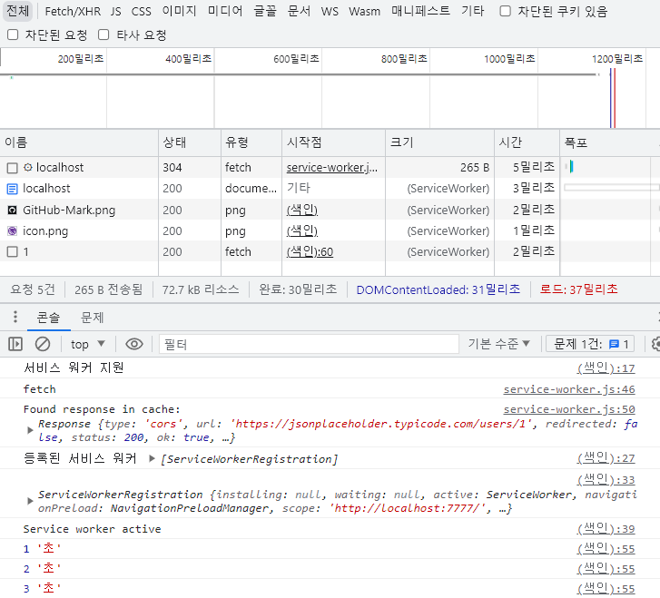

# HTTP Cache

자주 쓰이는 리소스를 나중에 사용하기 위해 사본으로 저장하고, 나중에 동일한 요청을 했을 때, 캐시된 사본이 존재한다면 서버로 요청을 보내는 것이 아닌 Cache로부터 제공 된다. (⇒ 캐싱)

## Cache는 왜 사용하는 것일까?

네트워크에 대해 이해하고 있어야한다.

네트워크를 통해서 리소스를 가져오는 것은 느리고 비용이 많이 든다.

클라이언트가 자주 쓰는 페이지가 존재한다면 해당 페이지에 접속할 때마다 항상 서버로부터 요청을 보내고 서버는 같은 리소스를 클라이언트에게 매 번 보내야한다.

그러면 클라이언트는 매 번 해당 페이지를 이용할 때마다 UX적으로 느린 경험을 할 수 밖에 없다.

또한 서버도 비용이 많이드는 리소스를 매 번 전달해야하므로 서버측에서도 부담이 많이 된다.

이러한 문제점을 해결하기 위해 캐시를 사용하는 것이다.

캐시를 이용하면 서버와 클라이언트 둘 다 이점을 볼 수 있다. 대부분 trade-off가 적용되는데 캐시는 trade-off가 적용되지 않는다.

## Cache가 주는 이점들

1. 불필요한 데이터 전송을 줄여 네트워크 비용 감소
2. 네트워크 병목현상과 거리로 인한 지연시간을 줄여 웹 페이지를 빠르게 불러옴으로써 UX 증가
3. 서버에 대한 요청을 줄여 서버의 부하 감소
4. 갑작스런 요청 쇄도에 대처 가능

## HTTP Cache 종류

클라이언트에서 HTTP 요청을 보내면, 해당 요청을 바로 서버로 전송하지 않고 캐시된 데이터가 존재하는지 확인한다.

캐시는 차례대로 서비스 워커 캐시 → 브라우저 캐시 → 프록시 캐시 (CDN) 순으로 확인 후 유효한 응답 값이 없을 경우 서버에 요청을 보내고 응답을 받게 된다.


## Worker?

### Web worker

JavaScript를 백그라운드에서 실행할 수 있는 쓰레드를 생성하는 기술

웹 워커는 UI 쓰레드와 별개로 존재하므로 DOM에 접근할 수 없지만 자체적인 Global scope에서 Window scope와 같은 기능을 제공하기 때문에 지원 가능하다.

### Shared worker

윈도우 창이나 Iframe, worker등의 다른 브라우징 컨텍스트에서도 접근이 가능하다.

특정 사이트에 로그인 후 중간에 어떤 탭에서 로그아웃 하면 Shared worker에서 자신을 참조하고 있는 모든 브라우저 컨텍스트에 메시지를 보내 다른 탭에 잇는 로그인 된 사이트도 로그아웃 시킨다.

(이 경우가 두 개의 탭을 동일한 사이트에서 로그인 했을 때 한 쪽에서 로그아웃 하면 다른 탭도 로그아웃 되는 현상)

### Service worker

다른 문서나 소스로부터 발생되는 이벤트에 대응하기 위한 이벤트 Driven 방식이며 이벤트 기반 워커로서 JavaScript 파일의 형태를 갖고 있다.

네트워크 요청을 가로채서 네트워크 사용 가능 여부에 따라 적절한 행동을 취하고, 서버 리소스를 업데이트 할 수 있다.

지속적인 백그라운드 프로세싱을 위해 새 런타임을 생성하는 것이 아니라 설치하는 방식이다.

웹 페이지와 별개로 존재하므로 DOM이나 Window 요소에 접근 불가하며 비동기적으로 설계되어 XHR이나 웹 저장소 등의 API를 서비스 워커 내에서 사용할 수 없다.

비동기로 설계되어 서비스 워커는 JavaScript 서비스와 다른 스레드에서 동작하므로 블로킹하지 않는다.

- Service worker의 역할 및 기능
  - 네트워크 프록시 역할
  - 오프라인 웹을 구현하기 위해 캐시 활용 가능
  - 브라우저 창이 닫힌 상태(백그라운드)에서도 동작하므로 푸시 알림 구현 가능
  - 채팅 혹은 사진 업로드 기능 사용 중 컴퓨터가 오프라인 상태가 되는 경우 인터넷이 다시 연결됐을 때 메시지 전송을 실패하지 않는 백그라운드 동기화 가능
  - 리소스를 세부적으로 캐싱 가능
  - 보안 상의 이유로 HTTPS 통신이 가능한 서버에서만 동작 가능 (Localhost 제외)
    - 네트워크 요청을 수정할 수 있어 중간자 공격(Man In The Middle : MITM)에 취약
      > 중간자 공격(Man In The Middle : MITM) :
      > 공격자가 사용자의 인터넷 서버와 해당 인터넷 트래픽의 목적지 사이에 끼어들어 데이터 전송을 가로채는 공격이다. 꼭 사용자와 인터넷 서버간이 아니더라도 사용자와 사용자 간에서도 데이터를 가로챌 수 있다.
      > 자세한 내용 참고
      > https://nordvpn.com/ko/blog/mitm/
- Life Cycle
  Registration → Install → Activate → Idle → Fetch
- Service worker state
  - Installing
  - Installed
  - Activating
  - Activated
  - Redundant

### 서비스 워커 캐시

서비스 워커에서 fetch 이벤트 핸들러를 만들고 네트워크 요청을 가로채서 네트워크가 아닌 서비스 워커의 캐시에서 확인하고 반환한다.

## 캐싱 레이어

### 서비스 워커 캐싱

서비스 워커는 네트워크 유형의 HTTP 요청을 가로채고 캐싱 전략을 사용하여 브라우저에 반환되어야 하는 리소스를 결정한다.

서비스 워커 캐시와 HTTP 캐시는 일반 용도로 사용되지만 서비스 워커 캐시가 정확히 무엇을 캐시하고 어떻게 캐싱하는지에 대해 알아보자


서비스 워커는 이벤트 리스너(일반적으로 fetch 이벤트)로 HTTP 요청을 가로채게 된다.

이미지를 보면 [Cache-FIrst 캐싱 전략](https://developer.chrome.com/docs/workbox/modules/workbox-strategies/#cache-first-cache-falling-back-to-network)으로 캐시 데이터를 먼저 확인하여 불필요한 HTTP 요청을 줄여준다.

서비스 워커의 사용법 (Life Cycle)


- Registration (등록)

  - index.html 파일 script 태그 안에 `navigator.serviceWorker.register()`메서드를 사용해 서비스 워커를 등록한다.

    ```html
    <!DOCTYPE html>
    <html lang="en">
      <head>
        <meta charset="UTF-8" />
        <meta name="viewport" content="width=device-width, initial-scale=1.0" />
        <title>mySite</title>
      </head>
      <body>
        <h1>Test</h1>
        <script>
          const registerServiceWorker = async () => {
            // 브라우저에서 서비스 워커를 지원하는지 체크
            if ("serviceWorker" in navigator) {
              try {
                console.log("서비스 워커 지원");

                // 등록된 서비스 워커 지우기
                navigator.serviceWorker.getRegistrations().then((r) => {
                  r[0].unregister();
                });

                // 현재 등록된 서비스 워커 확인
                navigator.serviceWorker
                  .getRegistrations()
                  .then((res) => console.log("등록된 서비스 워커", res));

                // 서비스 워커 등록
                const registration = await navigator.serviceWorker.register(
                  "./service-worker.js"
                );
                console.log(registration);
                if (registration.installing) {
                  console.log("Service worker installing");
                } else if (registration.waiting) {
                  console.log("Service worker installed");
                } else if (registration.active) {
                  console.log("Service worker active");
                }
              } catch (error) {
                console.error(`Registration failed with ${error}`);
              }
            }
          };

          registerServiceWorker();
        </script>
      </body>
    </html>
    ```

- Install (설치)

  - 사이트 첫 방문 시 Install 이벤트 발생 후 페이지 캐싱
  - Install 리스너에서 캐시 초기화 후 오프라인 사용을 위해 파일들 추가
  - 캐시 이름을 저장할 변수를 생성하고, 파일들을 하나의 배열에 저장

  ```js
  // service_worker.js

  // 서비스 워커 설치
  self.addEventListener("install", (pEvent) => {
    console.log("(install)서비스워커 설치 중");

    // 설치 완료되면 waitUntil 실행
    pEvent.waitUntil(
      // 캐시 변수 cacheName1 생성 후 cache.addALL() 메서드로 파일들을 하나의 배열로 저
      caches
        .open("cacheName1")
        .then((cache) => cache.addAll(["/test.png", "/test.ico"]))
    );
  });
  ```

- Activate (활성화)

  - 기존 서비스 워커가 없으면 설치를 시도하고, 설치를 성공하면 활성화한다.
  - 만약 기존에 서비스 워커가 존재한 경우, 새로운 버전을 백그라운드에서 설치하지만 아직 활성화는 하지 않는다. 이 시점의 워커를 `대기 중인 워커`라고 부르며, 대기 중인 워커는 이전 버전의 서비스 워커를 사용하는 페이지가 모두 닫힌 후에 활성화가 되고 이를 `활성 워커`라고 한다.
  - 활성화 절차를 더 빨리 하려면 `ServiceWorkerGlobalScope.skipWaiting()`을 사용할 수 있고, 새로운 활성 워커는 `Clients.claim()`을 사용해 이전 페이지를 회수할 수 있다.
  - active 했을 때 과거의 캐시를 지우는 등 이전 서비스 워커 관련된 항목을 정리하면 좋다.

  ```js
  // service-worker.js

  // 서비스 워커 활성화
  self.addEventListener("activate", (event) => {
    // 캐시 허용 리스트
    const cacheAllowlist = ["v2"];

    // 활성화 되면 waitUntil 실행
    event.waitUntil(
      caches.keys().then((keyList) => {
        Promise.all(
          keyList.map((key) => {
            // 이전에 생성한 캐시가 허용되지 않았다면
            if (!cacheAllowlist.includes(key)) {
              // 해당 캐시를 지웁니다.
              return caches.delete(key);
            }
          })
        );
      })
    );
  });
  ```

- Fetch

  - 서비스 워커 설치 후 fetch 요청을 감지 후 처리

  ```js
  // service-worker.js

  // 요청이 올 때마다 가로채기
  self.addEventListener("fetch", (event) => {
    console.log("fetch");
    event.respondWith(
      caches.match(event.request).then((response) => {
        // request에 캐시가 있다면 반환
        if (response) {
          console.log("Found response in cache:", response);

          return response;
        }
        console.log("No response found in cache. About to fetch from network…");

        // 없으면 네트워크 fetch로 요청
        return fetch(event.request)
          .then((response) => {
            console.log("Response from network is:", response);

            return response;
          })
          .catch((error) => {
            console.error("Fetching failed:", error);

            throw error;
          });
      })
    );
  });
  ```

    <details>
      <summary>카카오 tech 블로그에서 사용한 예시</summary>
        
        ```html
        <!--index.html-->
        <script>
        			// ...
        			// 서비스 워커 등록 후 fetch 요청
        			registerServiceWorker();
              fetch("https://jsonplaceholder.typicode.com/users/1")
                .then((response) => response.json())
                .then((data) => console.log(data))
                .catch((error) => console.log(error));
        </script>
        ```
        
        ```jsx
        self.addEventListener("fetch", function (event) {
          const { method, headers, url } = event.request;
          console.log("[SW] Fetch Method : ", method);
          console.log("[SW] Fetch Headers : ", headers);
          console.log("[SW] Fetch URL : ", url);
        });
        ```
        
        </details>

### 실제 실행해보기

- 캐시 확인

  캐시 저장공간에 2개의 캐시를 생성했다. cache-v1과 cacheName이 있는데 activate 됐을 때 허용된 캐시만 남기고 허용되지 않은 캐시는 삭제되는지 테스트 해봤다. (허용되지 않은 캐시는 cacheName)

  

  성공적으로 허용되지 않은 캐시는 사라지는 것을 볼 수 있다.

  

- 캐시가 저장되고 삭제되는 것을 봤으니 오프라인 모드에서 동작하는지 확인해봐야죠

  

  네트워크 환경을 오프라인으로 변경 후 새로고침 하면 인터넷 연결 없음이 뜨지만

  이 후에 서비스 워커가 설치 및 서비스 워커가 실행되면서 캐시에 저장되어 있는 파일을 가져오게 되고 정상적으로 동작하는 것을 볼 수 있다.

- 외부 url fetch로 호출 시 3초가 걸리도록 설정했다.
  
  캐시 비우기 및 강력 새로고침하면 아래 사진처럼 3초 뒤에 fetch 데이터를 호출한다.
  
  새로고침하면 캐시되어있는 데이터를 바로 가져오는 것을 볼 수 있다.
  

### 동작 시나리오 정리

1. 사용자가 처음 웹 서비스에 들어오면 서비스 워커가 설치됨.
2. 서비스 워커는 Cache Storage API를 이용해 정적 파일을 캐시에 저장.
3. 서비스 워커 설치 후 실행되면서 허용되지 않은 캐시가 있을 경우 삭제.
4. 이후 사용자가 요청을 보내면 서비스 워커에 의해 캐시 반환.
   ⇒ 오프라인 환경에서도 서비스 워커 캐시를 반환하므로 정상 작동.
5. 만약 캐시에 해당 요청에 대한 반환 값이 없다면 HTTP 요청으로 전송

### 주의사항

1. service worker는 https와 [localhost](http://localhost) 환경에서 동작 (본인은 express 환경에서 동작시킴)

   

2. 개발자도구 > 애플리케이션 > 좌측 탭에 Service Workers > 새로고침 시 업데이트 체크

   

3. express 환경에서 진행할 경우 http://localhost:7777/service-worker.js ~~~관련 에러가 뜰 경우 정적 파일을 찾지 못하는 것이기 때문에 express에서 아래 사진과 같이 설정해줘야 함

   

4. 만약 아래와 같이 cache.addAll에 대한 에러가 발생했다 캐시하는 목록들 중에서 404 error가 발생했기 때문이다.

   

   네트워크 탭을 열어보면 취소된 내용 말고, index.html 404 Error가 보인다.
   해당 index.html을 가져오지 못하는 것이므로 경로 수정을 해주면 해결된다.

   index.html은 / 경로로 수정하면 해결된다.

   

   수정한 결과는 다음과 같이 캐시 저장공간에 캐시할 파일들이 추가된 것을 확인할 수 있다.

   

   

5. 대부분의 블로그나 service worker를 다루는 사이트에서 fetch 요청을 캐시할 때 다음과 같은 코드를 사용한다.

   ```js
   self.addEventListener("fetch", (event) => {
     event.respondWith(
       fetch(event.request).catch(() => {
         return caches
           .open(cacheName)
           .then((cache) => cache.match(event.request));
       })
     );
   });
   ```

   코드를 보면 잘 동작될 것 같은 코드지만, 내 환경에서는 동작하지 않았다.

   `fetch(…).catch` 에 대한 에러가 발생했다.

   내가 생각한 이유는 fetch는 HTTP 통신 방법인데 나는 오프라인 환경에서 동작을 시켜야 했기 때문에 안됐던 것 같다.

   그래서 나는 [MDN에서 제공하는 FetchEvent request 예제](https://developer.mozilla.org/en-US/docs/Web/API/FetchEvent/request)를 사용했다.

   ```js
   // 요청이 올 때마다 가로채기
   self.addEventListener("fetch", (event) => {
     console.log("fetch");
     event.respondWith(
       caches.match(event.request).then((response) => {
         if (response) {
           console.log("Found response in cache:", response);

           return response;
         }
         console.log(
           "No response found in cache. About to fetch from network…"
         );

         return fetch(event.request)
           .then((response) => {
             console.log("Response from network is:", response);

             return response;
           })
           .catch((error) => {
             console.error("Fetching failed:", error);

             throw error;
           });
       })
     );
   });
   ```

### 참고

<details>
 <summary>service worker</summary>
    - 기업 기술 블로그에서 사용 예시
    
    https://fe-developers.kakaoent.com/2022/221208-service-worker/
    
    - 개인 블로그 설명
    
    [https://velog.io/@ouo_yoonk/PWA-Service-worker-그리고-캐시#http-cache와-service-workder-cache](https://velog.io/@ouo_yoonk/PWA-Service-worker-%EA%B7%B8%EB%A6%AC%EA%B3%A0-%EC%BA%90%EC%8B%9C#http-cache%EC%99%80-service-workder-cache)
    
    https://jdh5202.tistory.com/817 (참고하는데 도움 됨)
    
    https://shj.rip/bc900e3f-cc71-4a7e-b81d-3ffb8cdf6f37
    
    https://blog.arnellebalane.com/offline-web-applications-with-service-workers-29b23b49b305 (예시와 설명이 잘 되어 있음)
    
    https://somedaycode.github.io/develop/2021/03/12/cacheStorage/
    
    - web dev (구글 개발자들의 아티클)
    
    https://web.dev/i18n/ko/service-worker-caching-and-http-caching/
    
    https://developer.chrome.com/docs/workbox/modules/workbox-strategies/#cache-first-cache-falling-back-to-network
    
    https://web.dev/offline-cookbook/#serving-suggestions
    
    https://web.dev/service-workers-cache-storage/
    
    - MDN
    
    https://developer.mozilla.org/ko/docs/Web/API/Service_Worker_API
    
    https://developer.mozilla.org/en-US/docs/Web/API/ServiceWorkerGlobalScope/install_event
    
    https://developer.mozilla.org/en-US/docs/Web/API/ServiceWorkerGlobalScope/activate_event
    
    https://developer.mozilla.org/ko/docs/Web/API/ServiceWorker
    
    https://developer.mozilla.org/en-US/docs/Web/API/CacheStorage/delete
    
    https://developer.mozilla.org/en-US/docs/Web/API/FetchEvent/request
    
    - 문제 해결 참고
    
    https://stackoverflow.com/questions/47527223/a-bad-http-response-code-404-was-received-when-fetching-the-script
    
    https://stackoverflow.com/questions/39136625/service-worker-registration-failed
    
    https://stackoverflow.com/questions/66529102/uncaught-in-promise-typeerror-failed-to-execute-cache-on-addall-request
</details>
<details>
  <summary>cache</summary>
    - MDN
    
    https://developer.mozilla.org/en-US/docs/Web/API/Cache/delete
    
    https://developer.mozilla.org/en-US/docs/Web/API/CacheStorage/delete
    
    https://developer.mozilla.org/en-US/docs/Web/API/Cache/match
    
    - web dev
    
    https://web.dev/cache-api-quick-guide/#cacheaddall
    
    - 개인 블로그
    
    [https://velog.io/@chltjdrhd777/기업과제-회고-cache-storage-및-기타-고생내용](https://velog.io/@chltjdrhd777/%EA%B8%B0%EC%97%85%EA%B3%BC%EC%A0%9C-%ED%9A%8C%EA%B3%A0-cache-storage-%EB%B0%8F-%EA%B8%B0%ED%83%80-%EA%B3%A0%EC%83%9D%EB%82%B4%EC%9A%A9)
    
    [https://doinge-coding.tistory.com/entry/웹스토리지-IndexedDB-Cache-API](https://doinge-coding.tistory.com/entry/%EC%9B%B9%EC%8A%A4%ED%86%A0%EB%A6%AC%EC%A7%80-IndexedDB-Cache-API)
    
    https://somedaycode.github.io/develop/2021/03/12/cacheStorage/
</details>
